# Titanic Surival Prediction
## Predict Survival from disaster in Titanic

**Author**: SHAILESH_DHAMA

### Business Problem:

To build a predictive model that answers the question: “what sorts of people were more likely to survive?” using passenger data 
(i.e, name, age, gender, socio-economic class, etc).

### Dataset : ./titanic_dataset.zip

## STEPS :

- Data Preprocessing and Data Cleaning.
- Feature Engineering for train and test/validation dataset.
- Convert Objects to Category using Label Encoder for train and test/validation dataset.
- Discrete Variable Correlation by Survival.
- Graph distributions of quantitative data.
- Multi-variable Comparison graphically.
- Graph distribution of qualitative data : Pclass
- Graph distribution of qualitative data: Sex
- AxesSubplot for side-by-side data comparisons
- Plot distributions of age of passengers who survived or did not survive
- Histogram comparison of sex, class, and age by survival
- Correlation heatmap of complete dataset.
- Machine Learning Modelling
- Accuracy Report.

## RESULTS :

#### Data Visualisations

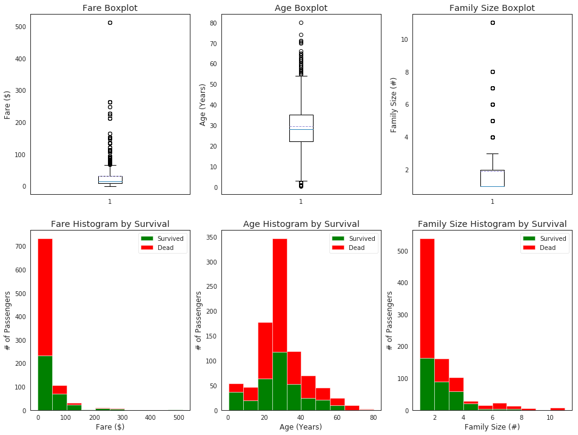
> Graph distribution of quantitative data

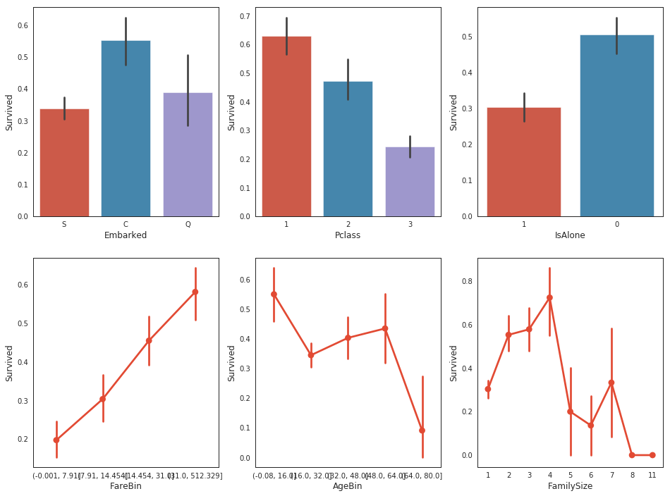
> Graph distribution of individual features by survival.

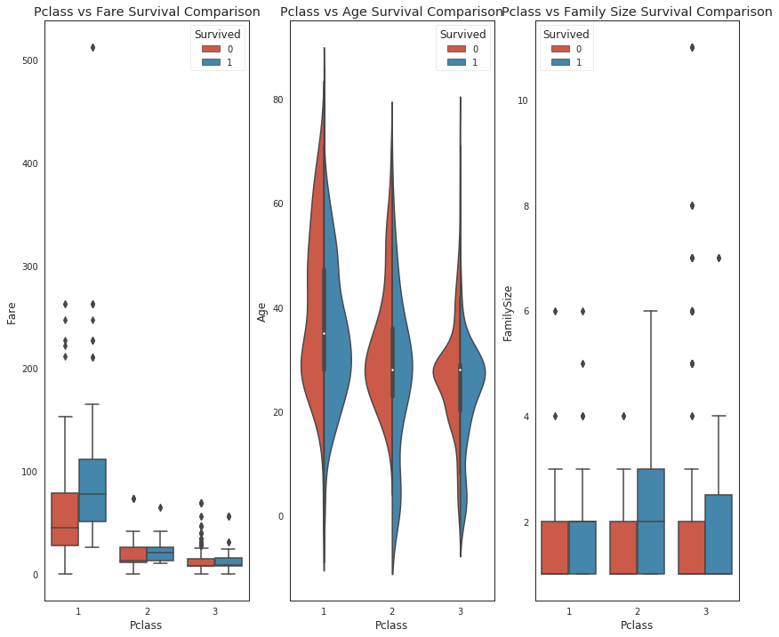
> Graph distribution of qualitative data: Pclass with other features

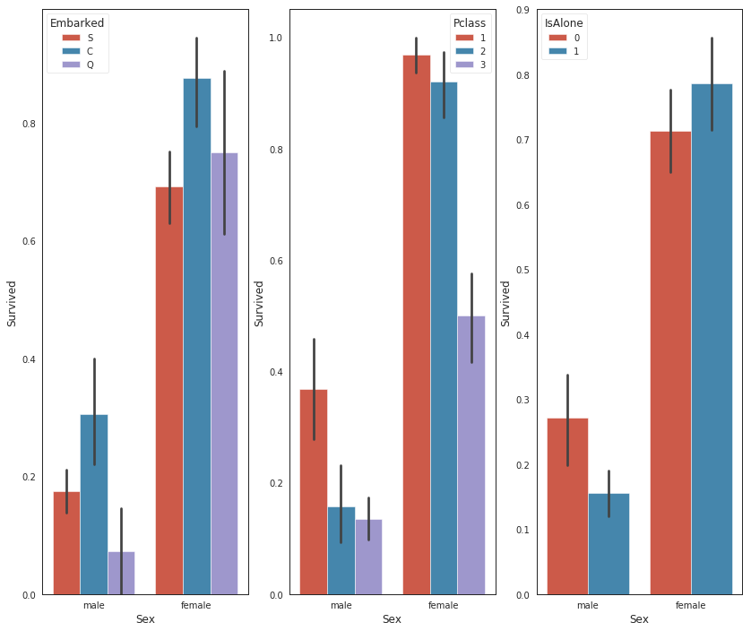
> Graph distribution of qualitative data: Sex with other features


> AxesSubplot for side-by-side data comparisons.

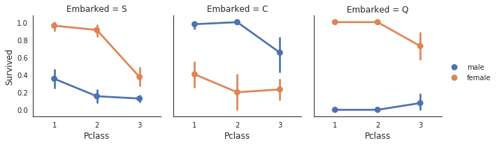
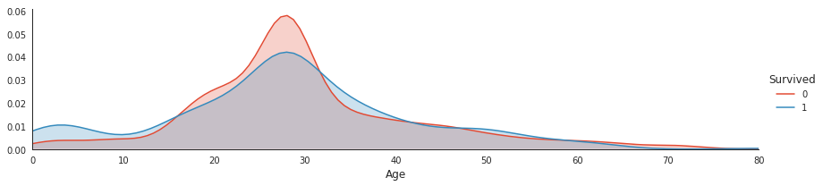
> Plot distributions of age of passengers who survived or did not survive.

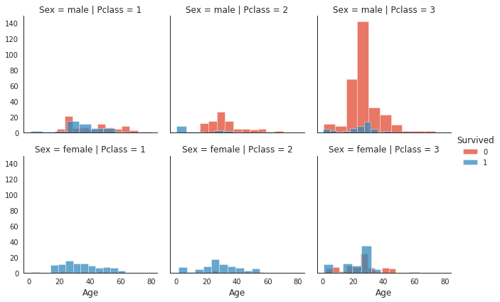
> Histogram comparison of sex, class, and age by survival.

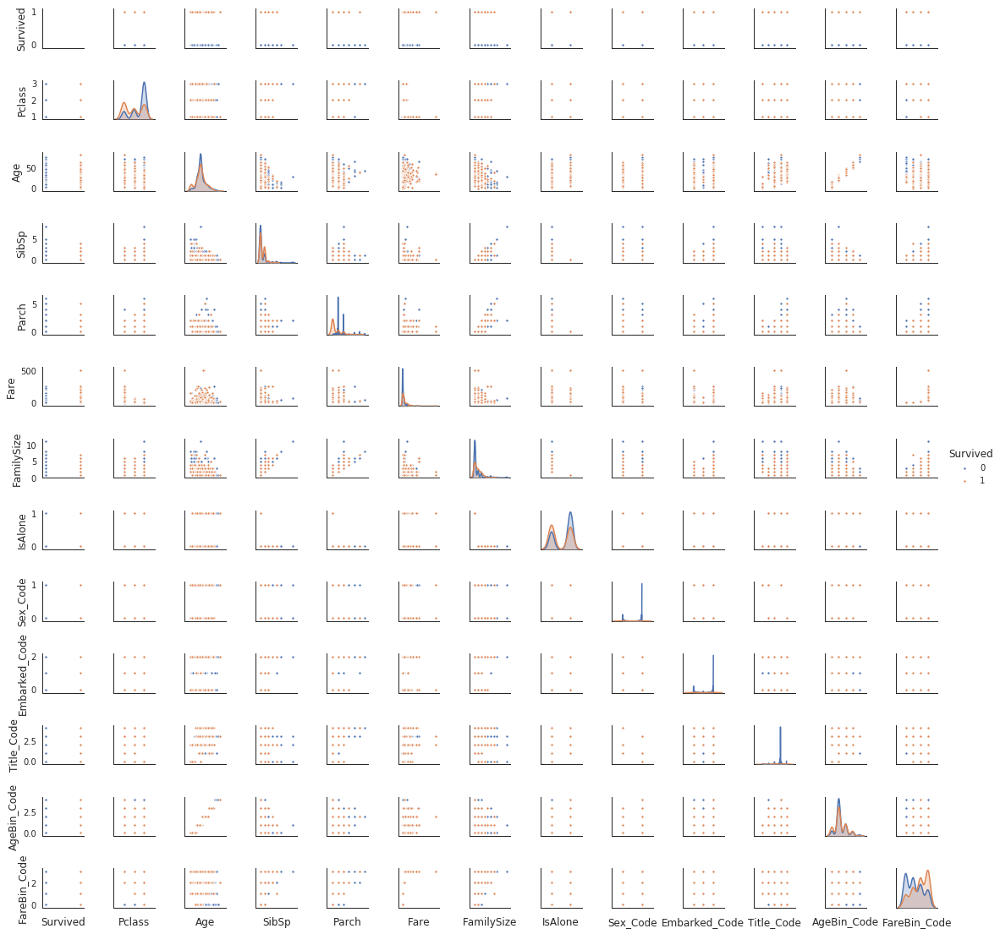
> Pair plots of entire dataset.

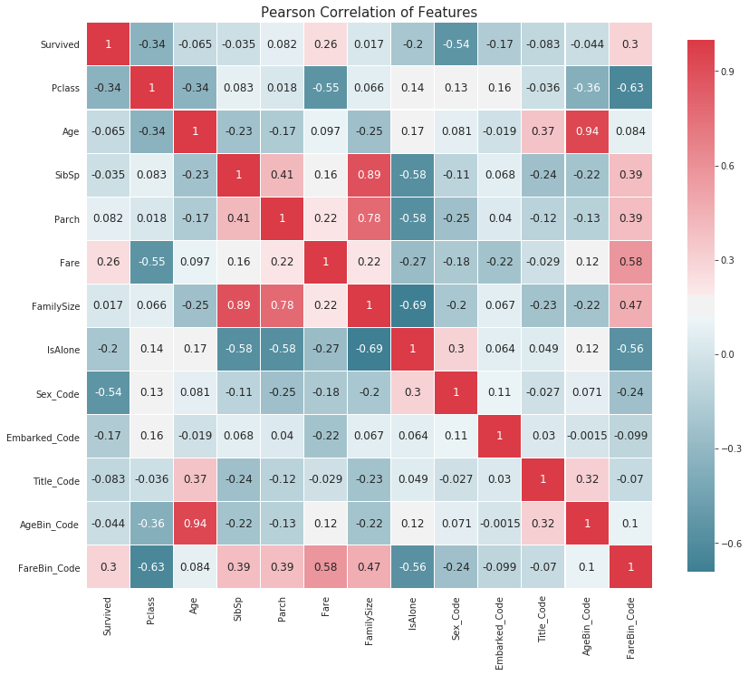
> Correlation heatmap of dataset.

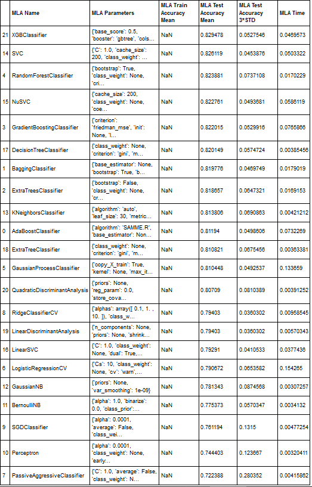
> Test Accuracy Mean of Machine Learning Algorithms[MLA].

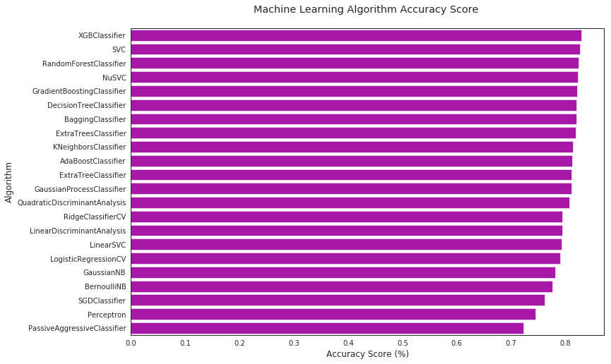
> Accuracy Scores of Machine Learning Algorithms.

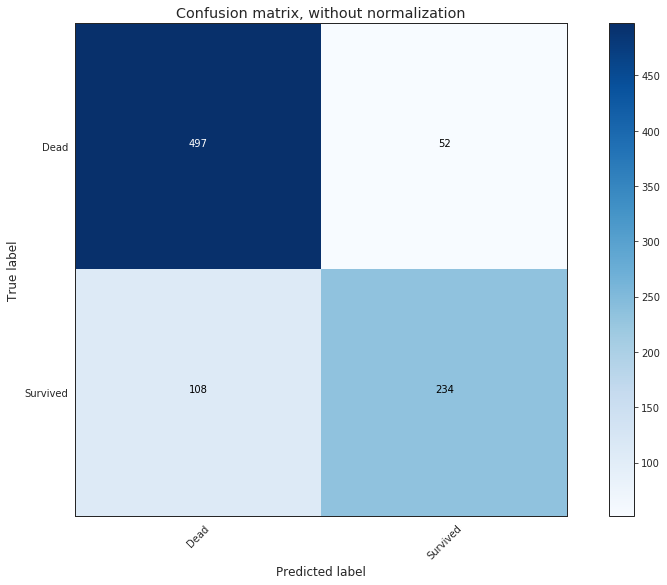
> Confusion matrix without normalization.

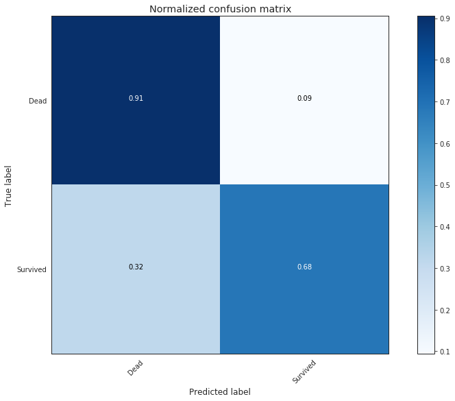
> Normalized confusion matrix. 

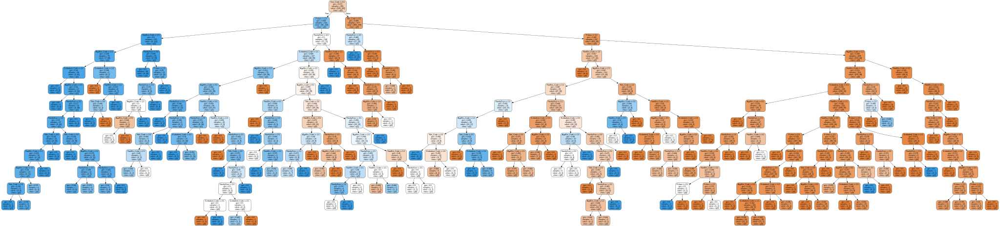
> Graph MLA version of Decision Tree. 

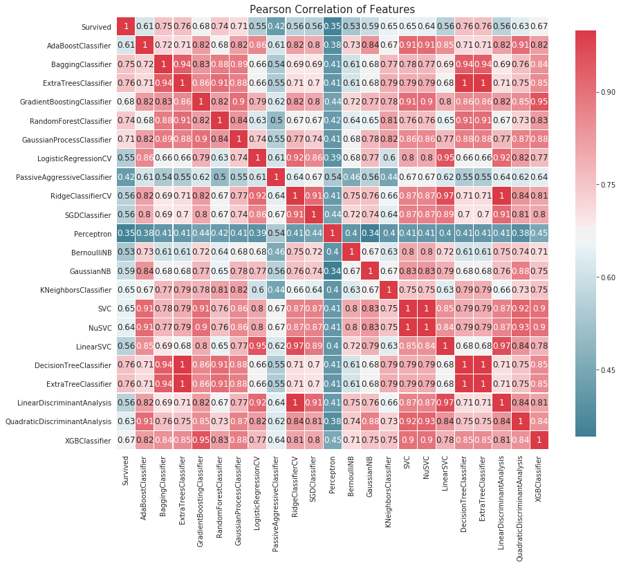
> Predicted pearson correlation of features.

### For further information

Please review the narrative of our analysis in [our jupyter notebook](./titanic-predictions-in-ml.ipynb)

For any additional questions, please contact **shaileshshettyd@gmail.com)

##### Repository Structure:

```
├── README.md                         <- The top-level README for reviewers of this project.
├── titanic-predictions-in-ml.ipynb   <- narrative documentation of analysis in jupyter notebook.
└── images                            <- both sourced externally and generated from code.
```
